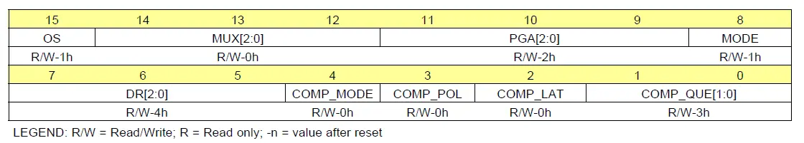

# ADS1115

## 基本参数

### 采样速率与时间

采样速率可以由 *配置寄存器* 中的*DR[2:0]*来控制，AD转换可以在一个周期内完成

### 操作模式

*ADS1115*有连续转换和单次转换，配置*寄存器*中的MODE位选择相应的工作模式，连续转换==>MODE=0，单次转换 ==>MODE=1

## ADS1115中的IIC

### IIC的地址选择

*ADS1115* 有地址引脚*ADDR* ，可以连接到GND, VDD, SDA或SCL

| ADDR PIN | SLAVE ADDRESS |
| -------- | ------------- |
| GND      | 1001000x  |
| VDD      | 1001001x  |
| SDA      | 1001010x  |
| SCL      | 1001011x  |

### 接收模式

ADS1115在从机接收模式下，主机发送到从机的第一个字节由7位设备地址组成,其次是低的R / W位。 主机发送的下一个字节是， ADS1115收到地址指针寄存器字节， 接下来的两个字节被写入地址由寄存器地址指针位P [1：0]给出。最后ADS1115返回字节。 数据寄存器字节为首先发送最高有效字节，然后发送最低有效字节

###  发送模式

​    在从机发送模式下，主机发送的第一个字节是7位从机地址，后跟高R / W位。 该字节将从机设置为发送模式， 从机发送的字节是数据寄存器的最高有效字节，由数据寄存器地址指针位P [1：0]指示， 然后，其余的最低有效字节由从机发送。

### 写入和读取寄存器

​    要从ADS1115访问特定的寄存器，主机必须首先写一个适当的值到地址指针寄存器中的地址指针位P [1：0]。在从机地址字节，低R / W位和成功的从机确认之后，直接写入地址指针寄存器。写入地址指针寄存器后，从机应答，而主机发出STOP或重复的START条件。从ADS1115读取时，写入位P [1：0]的前一个值确定要读取的寄存器。要更改读取哪个寄存器，必须将新值写入P [1：0]。要将新值写入P [1：0]，主机发出R / W位为低的从机地址字节，后跟地址指针寄存器字节。主机不必发送其他数据，并且可以发出STOP条件。如果需要重复读取同一寄存器，则无需连续发送地址指针寄存器，因为ADS1115会存储P [1：0]的值，直到被写操作修改为止。

### 读时序操作步骤

  1.发送写地址给ADS1115(0x90);
   2.向地址指针寄存器写数据，后两位有效，只能写0x00,0x01,0x02,0x03;
   3.发送读地址给ADS1115(0x91);
   4.读取ADS1115的数据（两个字节，MSB先行）;

### 写时序操作步骤

   1.发送写地址给ADS1115(0x90);
   2.向地址指针寄存器写数据，后两位有效，只能写0x00,0x01,0x02,0x03;
   3.发送数据给ADS1115（高位在前）

## 寄存器

### 1 地址指针寄存器(w)

7:2 Reserved (保留) W Always write 0h

1:0 P[1:0] W 

00:转换寄存器

01:配置寄存器

10:阈值比较器高字节寄存器

11:阈值比较器低字节寄存器

### 2 转换寄存器(P[1:0]=00)(r)

16位转换寄存器包含二进制二进制补码格式的最后一次转换结果。 上电后，转换寄存器清除为0，并保持0直到第一次转换完成. 15:0 D[15:0]

### 配置寄存器(P[1:0] = 0x01) [reset = 8583h]

​    16位配置寄存器用于控制工作模式，输入选择，数据速率，满量程范围和比较器模式



#### [15] OS

**运行状态或单次转换开始**
该位确定设备的运行状态。 
仅在掉电状态下才能编写OS，而在进行转换时则无效。
写时：
0：无效
1：开始单次转换（处于掉电状态）
读时：:
0：设备正在进行转换
1：转换空闲

#### [14:12] MUX

**输入多路复用器配置**
这些位配置输入多路复用器
000：AINP = AIN0和AINN = AIN1（默认）
001 : AINP = AIN0 and AINN = AIN3
010 : AINP = AIN1 and AINN = AIN3
011 : AINP = AIN2 and AINN = AIN3
100 : AINP = AIN0 and AINN = GND
101 : AINP = AIN1 and AINN = GND
110 : AINP = AIN2 and AINN = GND
111 : AINP = AIN3 and AINN = GND

#### [11:9] PGA

**可编程的增益放大器（量程的选择 ）**

这些位设置可编程增益放大器的FSR。
000 : FSR = ±6.144 V(1)
001 : FSR = ±4.096 V(1)
010 : FSR = ±2.048 V (default)
011 : FSR = ±1.024 V
100 : FSR = ±0.512 V
101 : FSR = ±0.256 V
110 : FSR = ±0.256 V
111 : FSR = ±0.256 V

#### [8]  MODE

 **设备运行方式** 该位控制操作模式。

0：连续转换模式

1：单次模式或掉电状态(默认)

#### [7:5] DR

转换速率

这些位控制转换速率
000：8 SPS
001：16 SPS
010：32 SPS
011：64 SPS
100：128 SPS（默认）
101：250 SPS
110：475 SPS
111：860 SPS

#### [4] COMP_MODE

 **比较器模式**
该位控制比较器工作
0：传统比较器（默认）
1：窗口比较器

#### [3] COMP_POL

比较器极性**
该位控制ALERT / RDY引脚的极性
0：低电平有效（默认）
1：高电平有效

#### [2] COMP_LAT

锁存比较器

该位控制ALERT / RDY引脚在被置为有效后锁存，还是在转换后处于上限和下限阈值范围之内清零。
0：非锁存比较器。 置位后ALERT / RDY引脚不锁存（默认）
1：锁存比较器。 置为有效的ALERT / RDY引脚保持锁存状态，直到转换数据由主服务器或适当的SMBus警报响应读取由主机发送。 设备以其地址响应，它是最低的当前声明ALERT / RDY总线的地址

#### [1:0] COMP_QUE

比较器置位和禁用

这些位执行两个功能。 设置为11时，比较器被禁用，ALERT / RDY引脚被设置为高阻抗状态。 当设置为任何其他值时，将启用ALERT / RDY引脚和比较器功能，并且该设置值确定连续的转换次数超过在声明ALERT / RDY引脚之前所需的上限或下限阈值
00：一次转换后断言
01：两次转换后置位
10：四次转换后置位
11：禁用比较器并将ALERT / RDY引脚设置为高阻抗（默认）

### Lo_thresh (P[1:0] = 2H) [reset = 8000h] 

### Hi_thresh (P[1:0] = 3H) [reset = 7FFFh]寄存器

   比较器使用的上下阈值以二进制补码格式存储在两个16位寄存器。 比较器为数字比较器。 因此，只要更改PGA设置，就必须更新这两个寄存器中的值（使能比较器前提下）。 通过将Hi_thresh寄存器MSB设置为1并将Lo_thresh寄存器MSB设置为0，要使用ALERT / RDY引脚的比较器功能，Hi_thresh寄存器值必须始终大于 Lo_thresh寄存器值。


## 代码

```c
//i2c_ads1115.h
#ifndef __IIC_ADS1115_H
#define __IIC_ADS1115_H

#include "i2c.h"

#define ADS1115_WRITE_ADDRESS        0x90
#define ADS1115_READ_ADDRESS         0x91
//以下两个预处理作为配置寄存器预处理要更改其配在这里更改
//也可以添加新的预处理对不同通道的采集或者选取不同的采样速率等
#define CONFIG_REG_H     ADS1115_REG_CONFIG_OS_START|\
                         ADS1115_REG_CONFIG_MUX_Diff_01|\
                         ADS1115_REG_CONFIG_PGA_4|\
                         ADS1115_REG_CONFIG_MODE_SINGLE
#define CONFIG_REG_L    ADS1115_REG_CONFIG_DR_128|\
                        ADS1115_REG_CONFIG_COMP_MODE_TRADITIONAL|\
                        ADS1115_REG_CONFIG_COMP_POL_LOW|\
                        ADS1115_REG_CONFIG_COMP_LAT_NONLATCH|\
                        ADS1115_REG_CONFIG_COMP_QUE_DIS


/***************/
//配置寄存器说明

//config register
/*CRH[15:8](R/W)
   BIT      15      14      13      12      11      10      9       8
   NAME     OS      MUX2    MUX1    MUX0    PGA2    PGA1    PGA0    MODE
CRL[7:0] (R/W)
   BIT      7       6       5       4       3       2       1       0
   NAME    DR0     DR1     DR0   COM_MODE COM_POL COM_LAT COM_QUE1 COM_QUE0


   -----------------------------------------------------------------------------------
 * 15    | OS             |  运行状态会单词转换开始
 *       |                | 写时:
 *       |                | 0   : 无效
 *       |                | 1   : 开始单次转换处于掉电状态时
 *       |                | 读时:
 *       |                | 0   : 正在转换
 *       |                | 1   : 未执行转换
 * -----------------------------------------------------------------------------------
 * 14:12 | MUX [2:0]      | 输入复用多路配置
 *       |                | 000 : AINP = AIN0 and AINN = AIN1 (default)
 *       |                | 001 : AINP = AIN0 and AINN = AIN3
 *       |                | 010 : AINP = AIN1 and AINN = AIN3
 *       |                | 011 : AINP = AIN2 and AINN = AIN3
 *       |                | 100 : AINP = AIN0 and AINN = GND
 *       |                | 101 : AINP = AIN1 and AINN = GND
 *       |                | 110 : AINP = AIN2 and AINN = GND
 *       |                | 111 : AINP = AIN3 and AINN = GND
 * -----------------------------------------------------------------------------------
 * 11:9  | PGA [2:0]      | 可编程增益放大器配置(FSR  full scale range)
 *       |                | 000 : FSR = В±6.144 V
 *       |                | 001 : FSR = В±4.096 V
 *       |                | 010 : FSR = В±2.048 V (默认)
 *       |                | 011 : FSR = В±1.024 V
 *       |                | 100 : FSR = В±0.512 V
 *       |                | 101 : FSR = В±0.256 V
 *       |                | 110 : FSR = В±0.256 V
 *       |                | 111 : FSR = В±0.256 V
 * -----------------------------------------------------------------------------------
 * 8     | MODE           | 工作模式
 *       |                | 0   : 连续转换
 *       |                | 1   : 单词转换
 * -----------------------------------------------------------------------------------
 * 7:5   | DR [2:0]       | 采样频率
 *       |                | 000 : 8 SPS
 *       |                | 001 : 16 SPS
 *       |                | 010 : 32 SPS
 *       |                | 011 : 64 SPS
 *       |                | 100 : 128 SPS (默认)
 *       |                | 101 : 250 SPS
 *       |                | 110 : 475 SPS
 *       |                | 111 : 860 SPS
 * -----------------------------------------------------------------------------------
 * 4     | COMP_MODE      | 比较器模式
 *       |                | 0   : 传统比较器 (default)
 *       |                | 1   : 窗口比较器
 * -----------------------------------------------------------------------------------
 * 3     | COMP_POL       | Comparator polarity
 *       |                | 0   : 低电平有效 (default)
 *       |                | 1   : 高电平有效
 * -----------------------------------------------------------------------------------
 * 2     | COMP_LAT       | Latching comparator
 *       |                | 0   : 非锁存比较器. (default)
 *       |                | 1   : 锁存比较器.
 * -----------------------------------------------------------------------------------
 * 1:0   | COMP_QUE [1:0] | Comparator queue and disable
 *       |                | 00  : Assert after one conversion
 *       |                | 01  : Assert after two conversions
 *       |                | 10  : Assert after four conversions
 *       |                | 11  : 禁用比较器并将ALERT/RDY设置为高阻抗 (default)
 * -----------------------------------------------------------------------------------
*/


//地址指针寄存器

#define ADS1015_REG_POINTER_CONVERT     (0x00)
#define ADS1015_REG_POINTER_CONFIG      (0x01)
#define ADS1015_REG_POINTER_LOWTHRESH   (0x02)
#define ADS1015_REG_POINTER_HITHRESH    (0x03)
// 单次转换开始
#define ADS1115_REG_CONFIG_OS_START                     (0x1U << 7)//设备单词转换开启 高字节的最高位
#define ADS1115_REG_CONFIG_OS_NULL                      (0x0U << 7)
//输入引脚选择和输入方式选择
#define ADS1115_REG_CONFIG_MUX_Diff_01                  (0x0U << 4)  // 差分输入0引脚和1引脚
#define ADS1115_REG_CONFIG_MUX_Diff_03                  (0x1U << 4)  // 差分输入0引脚和3引脚
#define ADS1115_REG_CONFIG_MUX_Diff_13                  (0x2U << 4)  // 差分输入1引脚和3引脚
#define ADS1115_REG_CONFIG_MUX_Diff_23                  (0x3U << 4)  // 差分输入2引脚和3引脚
#define ADS1115_REG_CONFIG_MUX_SINGLE_0                 (0x4U << 4)  //单端输入 00
#define ADS1115_REG_CONFIG_MUX_SINGLE_1                 (0x5U << 4)  //单端输入 01
#define ADS1115_REG_CONFIG_MUX_SINGLE_2                 (0x6U << 4)  //单端输入 10
#define ADS1115_REG_CONFIG_MUX_SINGLE_3                 (0x7U << 4)  //单端输入 11

//量程选择
#define ADS1115_REG_CONFIG_PGA_6                        (0x0U << 1) // +/- 6.1144
#define ADS1115_REG_CONFIG_PGA_4                        (0x1U << 1) // +/- 4.096
#define ADS1115_REG_CONFIG_PGA_2                        (0x2U << 1) // +/- 2.048
#define ADS1115_REG_CONFIG_PGA_1                        (0x3U << 1) // +/- 1.024
#define ADS1115_REG_CONFIG_PGA_05                       (0x4U << 1) // +/- 0.512
#define ADS1115_REG_CONFIG_PGA_02                       (0x5U << 1) // +/- 0.256

//运行方式

#define ADS1115_REG_CONFIG_MODE_SINGLE              (0x1U << 0)  //  单次
#define ADS1115_REG_CONFIG_MODE_CONTIN              (0x0U << 0)  //连续转换

//转换速率

#define ADS1115_REG_CONFIG_DR_8                     (0x0U << 5)
#define ADS1115_REG_CONFIG_DR_16                    (0x1U << 5)
#define ADS1115_REG_CONFIG_DR_32                    (0x2U << 5)
#define ADS1115_REG_CONFIG_DR_64                    (0x3U << 5)
#define ADS1115_REG_CONFIG_DR_128                   (0x4U << 5)
#define ADS1115_REG_CONFIG_DR_250                   (0x5U << 5)
#define ADS1115_REG_CONFIG_DR_475                   (0x6U << 5)
#define ADS1115_REG_CONFIG_DR_860                   (0x7U << 5)

//比较器模式
#define ADS1115_REG_CONFIG_COMP_MODE_TRADITIONAL    (0x0U << 4)//默认
#define ADS1115_REG_CONFIG_COMP_MODE_WINDOW         (0x1U << 4)


#define ADS1115_REG_CONFIG_COMP_POL_LOW         (0x0U << 3)//默认
#define ADS1115_REG_CONFIG_COMP_POL_HIG         (0x1U << 3)


#define ADS1115_REG_CONFIG_COMP_LAT_NONLATCH        (0x0U << 2)
#define ADS1115_REG_CONFIG_COMP_LAT_LATCH           (0x1U << 2)


#define ADS1115_REG_CONFIG_COMP_QUE_ONE         (0x0U << 0)
#define ADS1115_REG_CONFIG_COMP_QUE_TWO         (0x1U << 0)
#define ADS1115_REG_CONFIG_COMP_QUE_THR         (0x2U << 0)
#define ADS1115_REG_CONFIG_COMP_QUE_DIS         (0x3U << 0)

void ads1115_config_register(I2C_HandleTypeDef ads1115_I2cHandle,uint8_t pointADD,uint8_t configH,uint8_t configL);
int16_t ads1115_read_data(I2C_HandleTypeDef ads1115_I2cHandle);
double ads1115_get_voltage_val(I2C_HandleTypeDef ads1115_I2cHandle,uint8_t pointADD,uint8_t configH,uint8_t configL);
#endif

```

```c
//i2c_ads1115.c
#include "i2c_ads1115.h"
#include "usart.h"
#include "stdlib.h"

void ads1115_config_register(I2C_HandleTypeDef ads1115_I2cHandle,uint8_t pointADD,uint8_t configH,uint8_t configL)
{
    uint8_t reg_data[3]={pointADD,configH,configL};
    while(HAL_I2C_Master_Transmit(&ads1115_I2cHandle, ADS1115_WRITE_ADDRESS, reg_data, 3, 1000) != HAL_OK)
    {
        if(HAL_I2C_GetError(&ads1115_I2cHandle) != HAL_I2C_ERROR_AF)
        {
            printf("ads1115 Config Register error!!!\r\n");
        }
    }
}
int16_t ads1115_read_data(I2C_HandleTypeDef ads1115_I2cHandle)
{
    int16_t data;
    uint8_t rx_data[2]={0};

    while(HAL_I2C_Master_Transmit(&ads1115_I2cHandle, ADS1115_WRITE_ADDRESS, 0x00, 1, 1000) != HAL_OK)
    {
        if(HAL_I2C_GetError(&ads1115_I2cHandle) != HAL_I2C_ERROR_AF)
        {
            printf("ads1115 convert Register error!!!\r\n");
        }
    }

    while(HAL_I2C_Master_Receive(&ads1115_I2cHandle, ADS1115_READ_ADDRESS, rx_data, 2, 1000) != HAL_OK)
    {
        if(HAL_I2C_GetError(&ads1115_I2cHandle) != HAL_I2C_ERROR_AF)
        {
            printf("ads1115 read data error!!!\r\n");
        }
    }

    data=rx_data[0]*256+rx_data[1];
    return data;
}

double ads1115_get_voltage_val(I2C_HandleTypeDef ads1115_I2cHandle,uint8_t pointADD,uint8_t configH,uint8_t configL)
{
    double val;
    int16_t ad_val;

    ads1115_config_register(ads1115_I2cHandle,pointADD,configH,configL);
    HAL_Delay(10);
    ad_val=ads1115_read_data(ads1115_I2cHandle);
    if((ad_val==0x7FFF)|(ad_val==0X8000))//是否超量程了
    {
        ad_val=0;
        printf("over PGA\r\n");
    }

    switch((0x0E&configH)>>1)//量程对应的分辨率
    {
        case(0x00):
            val=(double)ad_val*187.5/1000000.0;//
        break;
        case(0x01):
            val=(double)ad_val*125/1000000.0;
        break;
        case(0x02):
            val=(double)ad_val*62.5/1000000.0;
        break;
        case(0x03):
            val=(double)ad_val*31.25/1000000.0;
        break;
        case(0x04):
            val=(double)ad_val*15.625/1000000.0;
        break;
        case(0x05):
            val=(double)ad_val*7.8125/1000000.0;
        break;
    }
    return val;

}
```

```c
//main.c
#include "main.h"
#include "i2c.h"
#include "usart.h"
#include "i2c_ads1115.h"
int main(void)
{
  double val;
  HAL_Init();
  SystemClock_Config();
  MX_I2C1_Init(); //IIC初始化
  MX_USART1_UART_Init();//串口初始化
  HAL_Delay(100);
  while(1)
 {
	  val=ads1115_get_voltage_val(hi2c1,0x01,CONFIG_REG_H,CONFIG_REG_L);
      printf("val is %f\r\n",val);
      HAL_Delay(1000);
  }

```

