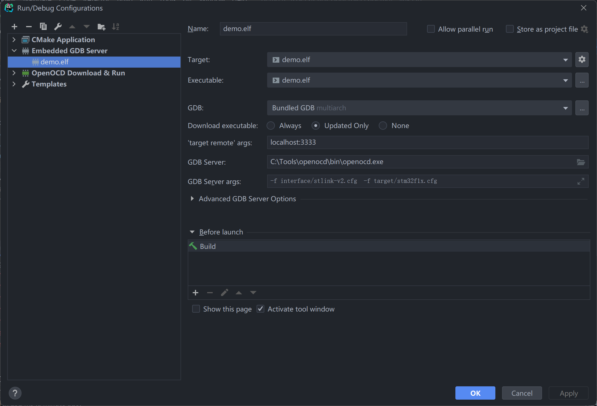
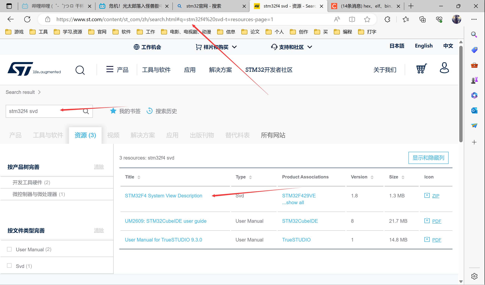
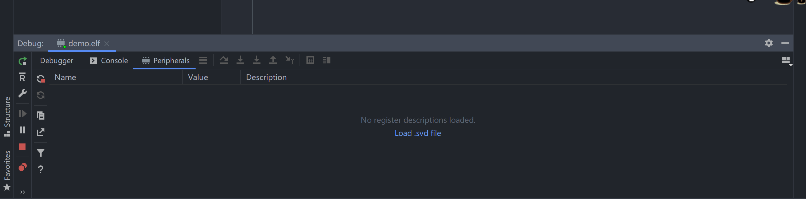
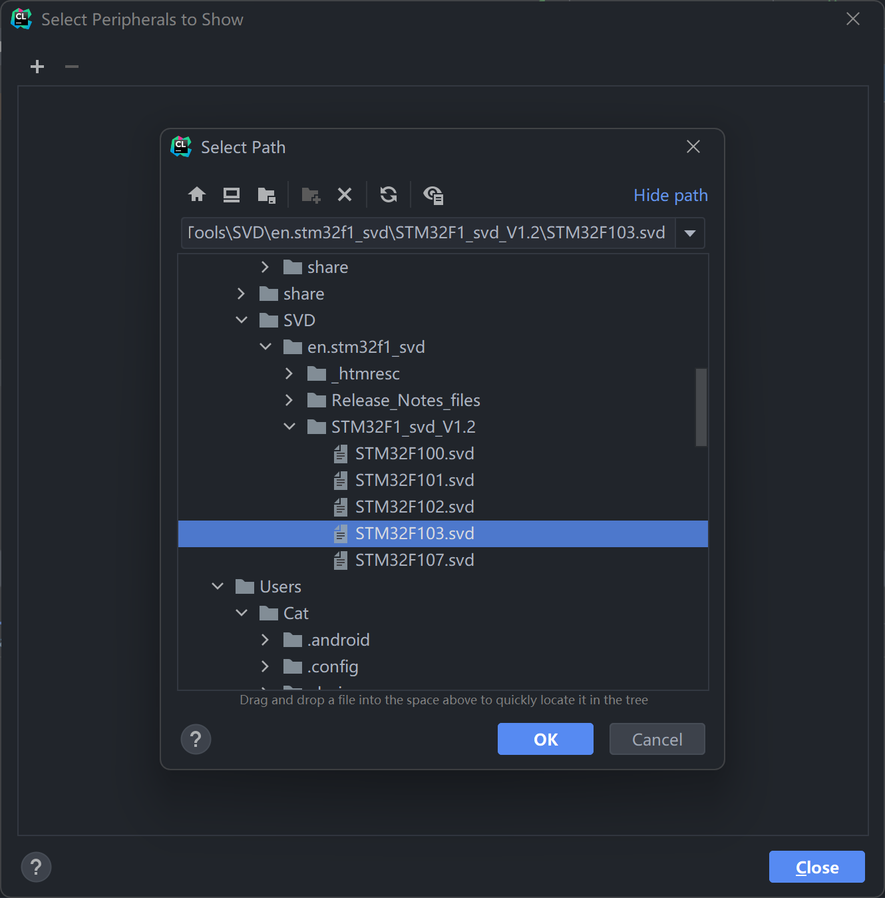
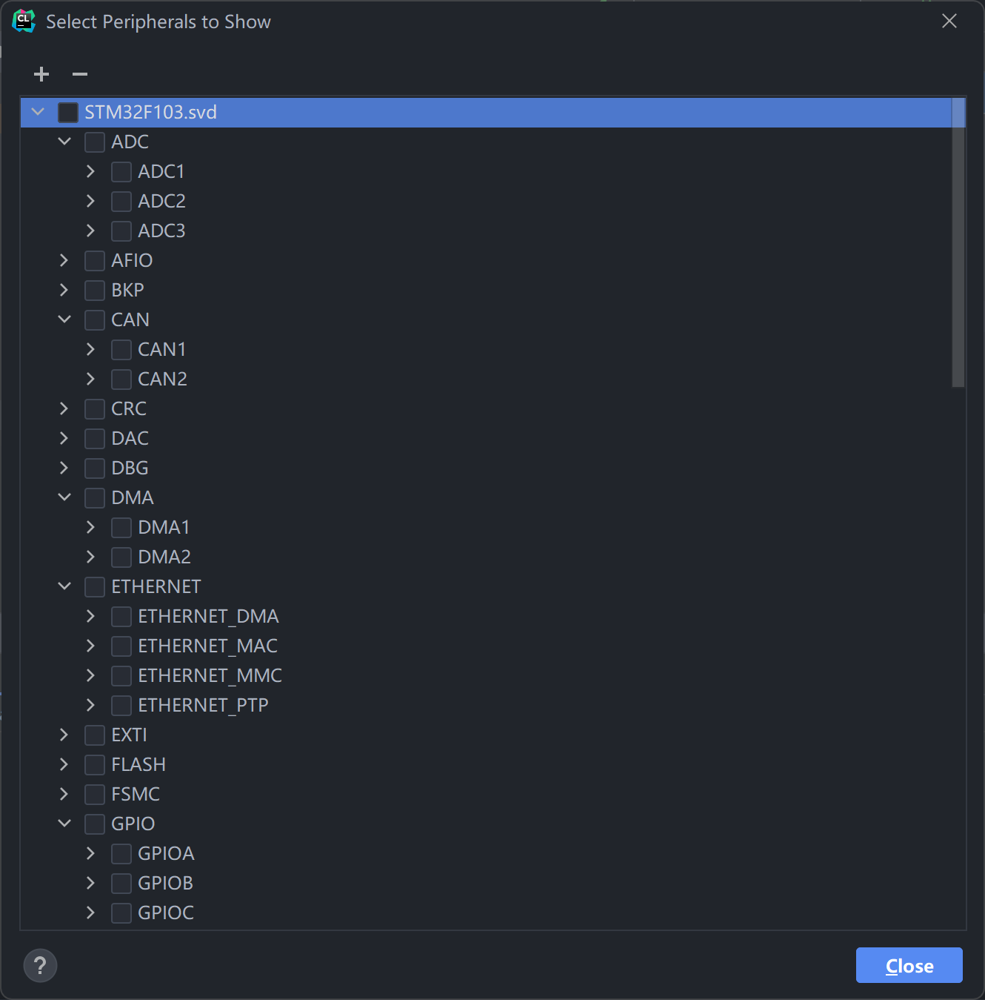
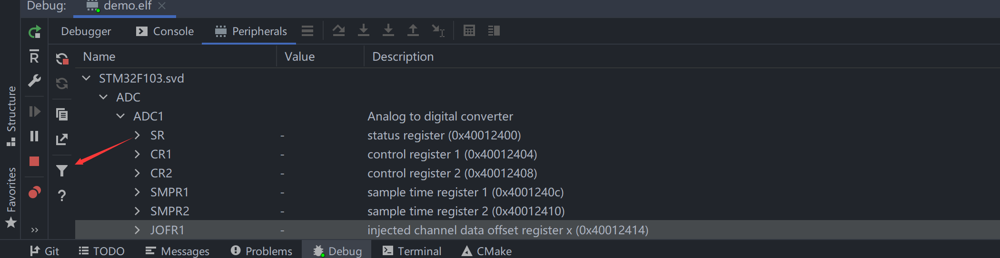

# st-link连接STM32

## stlink-v2的接口定义

```
 RST -| |- SWCLK
SWIM -| |- SWDIO
 GUD || |- GUD
3.3V -| |- 3.3V
5.0V -| |- 5.0V
```

## SWD接口定义

```
  VCC -| |- VCC
  N/U -| |- GND
  N/U -| |- GND
SWDIO -| |- GND
SWCLK -| |- GND
  N/U || |- GND
  SWO -| |- GND
RESET -| |- GND
  N/C -| |- GND
  N/C -| |- GND
```

连接st-link和SWD对应接口

#### 补充

JTAG接口定义

```
     VCC -| |- VCC
    TRST -| |- GND
     TDI -| |- GND
TWIO/TMS -| |- GND
TCK/TCLK -| |- GND
    RTCK || |- GND
     TDO -| |- GND
   RESET -| |- GND
     N/C -| |- GND
     N/C -| |- GND
```

## openocd + stlink下载

cfg文件

```cfg
# link.cfg file
source [find interface/stlink.cfg]

transport select hla_swd

source [find target/stm32f1x.cfg]
```

## clion openocd 调试

### 配置



ps 因为可能有国产的情况，这里的参数可以改为`-f 自己的.cfg`

### load .svd

以`stm32f4`为例

一、找到 `意法半导体官网` ;

二、搜索 `stm32f4 svd`;

三、下载 `.zip` 下载并解压到合适的文件夹下



在clion中 load .svd file





寄存器选择





## 问题处理

### 国产stm32错误

```ch
# link.cfg file
source [find interface/stlink-v2.cfg]

transport select hla_swd

set _CPUTAPID 0x2ba01477
set CPUTAPID 0x2ba01477

source [find target/stm32f1x.cfg]
```

根本原因是国产32位微控制器和STM32使用了不同版本的内核

参考《STM32F10xxx参考手册》第29章，其中第6节《ID代码和锁定机制》提到，在STM32F10x微控制器内部有多个ID编码。而在29.6.3和29.8.3小节中表明，不同的调试接口都有各自的IDCODE。这些IDCODE是由ARM定义的，而ST采用了默认值。实际上，这些IDCODE按照JEDEC-106 ID标准进行编码，可以用来识别设备信息，如基地址 0xE0042000的DBGMCU_IDCODE就用于描述芯片的设计信息如容量，版本等。

针对内核版本为ARM Cortex-M3 r1p1的STM32F1xxx，JTAG调试接口的IDCODE为0x3BA00477，而SWD调试接口的IDCODE为0x1BA01477。

然而，国产的32位微控制器许多都采用了ARM Cortex-M3 r2p0版本的内核。相应地，JTAG调试接口的IDCODE为0x0BA00477，而SWD调试接口的IDCODE为0x2BA01477
